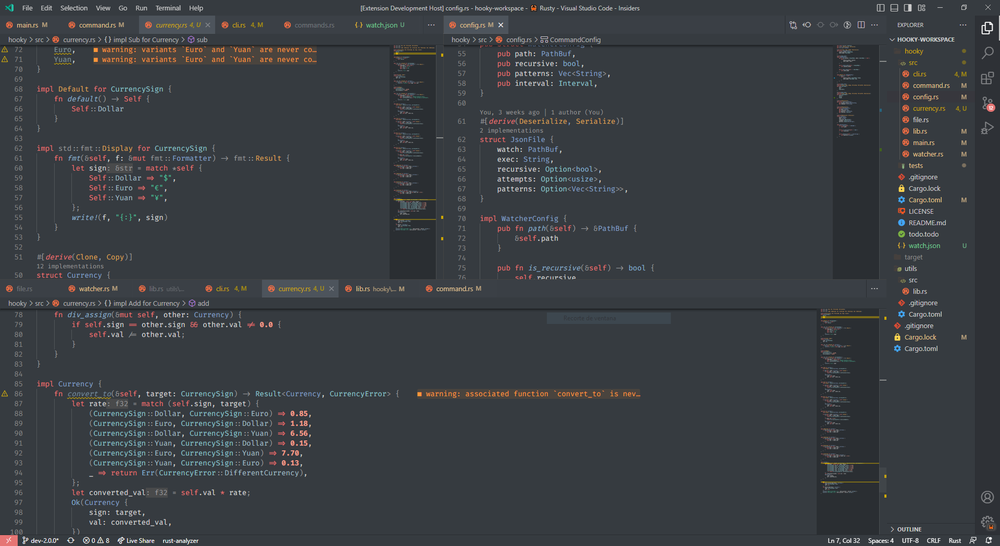

 
<h1 align="center" style= "font-size: 40px">
🕹️ Casio Theme
</h1>

Welcome to the Casio Theme for Visual Studio, a fresh and modern look for your favorite IDE! Inspired by a timeless design, this theme brings a touch of nostalgia to your coding environment, while also providing a comfortable and eye-catching experience.

If you're tired of the boring, monochromatic Visual Studio default theme, give Casio a try!

## 📸 Screenshots

## ✨ Features

- 🚀 Retro design with Casio color vibes
- 🕰️ Nostalgic coding experience
- 🙌 Easy on the eyes for extended coding sessions
- 🌈 A colorful palette that enhances syntax highlighting and code readability
- 🎨 A balanced mix of vibrant and muted tones that promotes a calm and focused mindset
- 🎯 An intuitive and consistent UI design that reduces distractions and enhances productivity

## 📦 Installation

1. Open Visual Studio
2. Go to **Extensions** > **Manage Extensions**
3. Search for **Casio Theme**
4. Click **Install**
5. Select **Casio Color Vibes Theme** from **Tools** > **Options** > **Environment** > **General** > **Color theme**
6. Enjoy!

## ⚠️ Limitations
> The theme is currently limited to Rust, but we plan to expand to other languages in the future.

## 📝 License

This project is licensed under the [MIT License](https://opensource.org/licenses/MIT). 📜

## ❤️ Created with love
The Casio theme was created with ❤️ by  **ElShyrux**. If you like it, please consider giving it a ⭐️ on GitHub!
